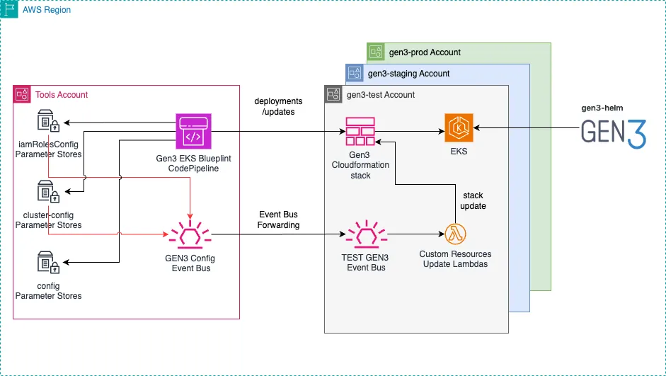

# Gen3 CDK Configuration Stack

This project is designed to configure and manage Gen3 EKS environments using AWS CDK. The stack is deployed in a **dedicated tools/management account** and automates the creation and management of SSM Parameter Stores for various Gen3 environments, as well as storing specific Gen3 credentials in AWS Secrets Manager. Each environment includes configurations for IAM roles, EKS clusters, and other infrastructure settings.

Please note: This project is designed for [**GEN3 EKS Blueprint Codepipeline**](https://github.com/AustralianBioCommons/gen3-eks-pipeline) to consume these configurations.

## Key Features

- **Automated SSM Parameter Management**: Automatically creates and updates SSM parameters for IAM roles, cluster configurations, and environment configurations.
- **EventBridge Rules**: Sets up rules to forward SSM parameter changes to an EventBus for event-driven updates.
- **Multi-environment Support**: Supports multiple Gen3 environments (e.g., `uat`, `staging`, `prod`) with customizable configuration files.
- **Reusability**: Environment-specific settings can be reused and customized for different Gen3 environments.

## Solution Architecture
Below is the architecture diagram representing how the components interact: 


- **Event Bus**: Captures changes to Parameter Store values.
- **Lambda**: Triggers on Event Bus events and updates the CloudFormation stack.
- **SSM Parameter Store**: Stores configuration values like IAM role config and cluster config.


## Prerequisites

Ensure you have AWS CDK v2 installed and configured to deploy to your **dedicated tools/management account**. This stack is not designed for workload accounts deployment, see architecture diagram above.


## Table of Contents

- [Overview](#overview)
    - [Folder Structure](#folder-structure)
- [SSM Parameters](#ssm-parameters)
- [Configuration Files](#configuration-files)
- [Usage](#usage)
  - [Deploying the Stack](#deploying-the-stack)
  - [CDK Commands](#cdk-commands)
- [Example Configuration Files](#example-configuration-files)
  - [Cluster Configuration (clusterConfig.yaml)](#cluster-configuration-clusterconfigyaml)
  - [IAM Roles Configuration (iamRolesConfig.yaml)](#iam-roles-configuration-iamrolesconfigyaml)
  - [General Config (config.json)](#general-config-configjson)
- [EventBus Forwarding](#eventbus-forwarding)

- [Overview](#overview)
- [Folder Structure](#folder-structure)
- [Configuration Files](#configuration-files)
- [Usage](#usage)
- [EventBus Forwarding](#eventbus-forwarding)


## Overview

When this stack is run for the first time, it creates three blank SSM Parameter Stores for each Gen3 environment:

1. **`/gen3/<env>/iamRolesConfig`**: Stores IAM roles configurations required for Gen3 services.
2. **`/gen3/<env>/cluster-config/`**: Defines EKS cluster configurations such as node groups, autoscaling, Kubernetes versions, etc.
3. **`/gen3/config`**: Holds global configuration settings related to AWS networking, such as VPC IDs, subnets, and account information.

### Folder Structure

```
gen3-cdk-config
├── .secrets # Create this folder or provide path with configDir parameter
│   ├── clusterConfig.yaml
│   ├── config.json
│   └── iamRolesConfig.yaml
├── LICENSE
├── README.md
├── bin
│   └── gen3-cdk-config.ts
├── lib
│   └── gen3-cdk-config-stack.ts
```

## SSM Parameters
### **IAM Roles Configuration** (/`gen3/{env}/iamRolesConfig`):
Defines IAM role permissions for Gen3 services. This parameter stores configurations for services such as `arborist`, `audit`, `fence`, etc.

### **Cluster Configuration** (`/gen3/{env}/cluster-config`):
Specifies the configuration for EKS clusters, including details such as:
-   Kubernetes version
-   Node group size (min/max/desired)
-   Disk size
-   Instance types

### **Global Config** (`/gen3/config`):

Holds AWS infrastructure configuration like:

-   VPC IDs
-   Subnet IDs
-   Account information
-   Platform roles

## AWS Secrets Manager
### **ArgoCD initial credentials** (`argocdAdmin-{env}`)
Creates an ArgoCD admin password, which can be used for the initial login to configure new users if Single Sign-On (SSO) is not being used. This admin account must be disabled after user setup. For more information, refer to the [ArgoCD documentation](https://argo-cd.readthedocs.io/en/stable/operator-manual/user-management/).

### **Fence Config** (`fence-config-{env}`)
`WIP`

Configuration Files
-------------------

The stack uses three primary configuration files:

1.  `config.json`: Stores environment-specific AWS settings like account IDs, VPCs, and subnets.
2.  `clusterConfig.yaml`: Defines EKS cluster configurations for each environment.
3.  `iamRolesConfig.yaml`: Defines IAM roles configurations for Gen3 services per environment.

Usage
-----
**Clone the Repository**

        git clone git@github.com:AustralianBioCommons/gen3-cdk-config.git
        cd gen3-cdk-config

**Installing Dependencies**

        npm install

### Deploying the Stack

1.  Ensure you have set up your configuration files (see [Example Configuration Files](#example-configuration-files)).
2.  Specify the environments and parameters you want to update using the CDK context.

### CDK Commands

-   **List stacks**:

            cdk ls --context environments=uat,staging,prod --context update=roles,config,cluster

-   **Compare changes (diff)**:

            cdk diff --all --context environments=uat,staging,prod --context update=roles,config,cluster --context configDir=/user/documents/config

-   **Deploy stacks**:

            cdk deploy --all --context environments=uat,staging,prod --context update=roles,config,cluster

#### Parameters

-   **`environments`**: Defines the environments to manage, like `uat`, `staging`, `prod`.
-   **`update`**: Specifies which configuration to update. Options:
    -   `roles`: Updates IAM roles from `/gen3/<env>/iamRolesConfig`.
    -   `config`: Updates global configurations from `/gen3/config`. Use with caution---changing VPC, subnets, etc., may cause resource replacements and extended downtime.
    -   `cluster`: Updates cluster configurations from `/gen3/<env>/cluster-config/`.
-   **`configDir`**: Path to your configuration directory. Defaults to `../.secrets/config`.

Example Configuration Files
---------------------------

### Cluster Configuration (`clusterConfig.yaml`)

        clusters:
          test:
            version: "1.30"
            minSize: 1
            maxSize: 2
            desiredSize: 2
            diskSize: 100
            amiReleaseVersion: "1.30.0-20240703"
            instanceType: "m5.2xlarge"
            tags:
              Name: "GEN3 Cluster"
              Type: "ACDC"
              ENV: "test"
          staging:
            version: "1.30"
            minSize: 2
            maxSize: 3
            desiredSize: 2
            diskSize: 100
            amiReleaseVersion: "1.30.0-20240703"
            instanceType: "m5.2xlarge"
            tags:
              Name: "GEN3 Cluster"
              Type: "ACDC"
              ENV: "staging"
          prod:
            version: "1.30"
            minSize: 2
            maxSize: 3
            desiredSize: 2
            diskSize: 100
            amiReleaseVersion: "1.30.0-20240703"
            instanceType: "m5.2xlarge"
            tags:
              Name: "GEN3 Cluster"
              Type: "ACDC"
              ENV: "prod"

### IAM Roles Configuration (`iamRolesConfig.yaml`)

        services:
          test:
            arborist:
              - Effect: Allow
                Action:
                  - 's3:ListAllMyBuckets'
                  - 's3:GetObject'
                Resource: 'arn:aws:s3:::fake-bucket-test/*'
            audit:
              - Effect: Allow
                Action:
                  - 'sqs:SendMessage'
                  - 'sqs:ReceiveMessage'
                Resource: 'arn:aws:sqs:us-east-1:123456789012:fake-queue-test'
              - Effect: Allow
                Action:
                  - 'sqs:DeleteMessage'
                  - 'sqs:GetQueueAttributes'
                Resource: 'arn:aws:sqs:us-east-1:123456789012:fake-queue-test'
              - Effect: Allow
                Action:
                  - 's3:PutObject'
                  - 's3:GetBucketAcl'
                Resource: 'arn:aws:s3:::fake-logs-test/*'
            fence:
              - Effect: Allow
                Action:
                  - 's3:DeleteBucket'
                Resource: 'arn:aws:s3:::fake-data-test'
          staging:
            arborist:
              - Effect: Allow
                Action:
                  - 's3:ListBucket'
                  - 's3:DeleteObject'
                Resource: 'arn:aws:s3:::fake-bucket-staging/*'
          prod:
            arborist:
              - Effect: Allow
                Action:
                  - 's3:GetObjectVersion'
                  - 's3:RestoreObject'
                Resource: 'arn:aws:s3:::fake-bucket-prod/*'
            audit:
              - Effect: Allow
                Action:
                  - 'sqs:SendMessage'
                  - 'sqs:ReceiveMessage'
                Resource: 'arn:aws:sqs:us-east-1:123456789012:fake-queue-prod'
              - Effect: Allow
                Action:
                  - 'sqs:DeleteMessage'
                  - 'sqs:GetQueueAttributes'
                Resource: 'arn:aws:sqs:us-east-1:123456789012:fake-queue-prod'
              - Effect: Allow
                Action:
                  - 's3:GetBucketLocation'
                  - 's3:ReplicateObject'
                Resource: 'arn:aws:s3:::fake-logs-prod/*'
            fence:
              - Effect: Allow
                Action:
                  - 's3:GetBucketWebsite'
                Resource: 'arn:aws:s3:::fake-data-prod'

### Global Config (`config.json`)

        {
          "test": {
             "name": "test",
             "clusterName": "Gen3-Eks-test",
             "aws": {
                "account": "100000000001",
                "region": "ap-southeast-2"
             },
            "platformRoleName": "Test_Gen3_AWS_Platform_Team",
            "vpcId": "vpc-000000000001",
            "namespace": "cad",
            "clusterSubnets": [
              "subnet-000000000001",
              "subnet-000000000002",
              "subnet-000000000003",
              "subnet-000000000004",
              "subnet-000000000005",
              "subnet-000000000006"
            ],
            "nodeGroupSubnets": [
              "subnet-000000000001",
              "subnet-000000000002",
              "subnet-000000000003"
            ]
          },
          "staging": {
             "name": "staging",
             "clusterName": "Gen3-Eks-staging",
             "aws": {
                "account": "100000000002",
                "region": "ap-southeast-2"
             },
            "platformRoleName": "Staging_Gen3_AWS_Platform_Team",
            "vpcId": "vpc-000000000002",
            "namespace": "cad",
            "clusterSubnets": [
               "subnet-000000000007",
               "subnet-000000000008",
               "subnet-000000000009",
               "subnet-000000000010",
               "subnet-000000000011",
               "subnet-000000000012"
            ],
            "nodeGroupSubnets": [
               "subnet-000000000007",
               "subnet-000000000008",
               "subnet-000000000009"
            ]
        },
        "prod": {
           "name": "prod",
           "clusterName": "Gen3-Eks-prod",
           "aws": {
              "account": "100000000003",
              "region": "ap-southeast-2"
            },
           "platformRoleName": "Prod_Gen3_AWS_Platform_Team",
           "vpcId": "vpc-000000000003",
           "namespace": "cad",
           "clusterSubnets": [
              "subnet-000000000013",
              "subnet-000000000014",
              "subnet-000000000015",
              "subnet-000000000016",
              "subnet-000000000017",
              "subnet-000000000018"
            ],
            "nodeGroupSubnets": [
               "subnet-000000000013",
               "subnet-000000000014",
               "subnet-000000000015"
            ]
        },
        "tools": {
           "name": "tools",
           "aws": {
              "account": "100000000004",
              "region": "ap-southeast-2"
            },
            "platformRoleName": "Tools_Gen3_AWS_Platform_Team",
            "vpcId": "",
            "namespace": "",
            "subnets": []
        }
    }
  

EventBus Forwarding
-------------------
`Feature currently being tested`
EventBridge rules are automatically created to forward changes to the following SSM parameters:

1.  `/gen3/<env>/iamRolesConfig`
2.  `/gen3/<env>/cluster-config`

This enables event-driven updates based on changes to IAM roles or cluster configurations.